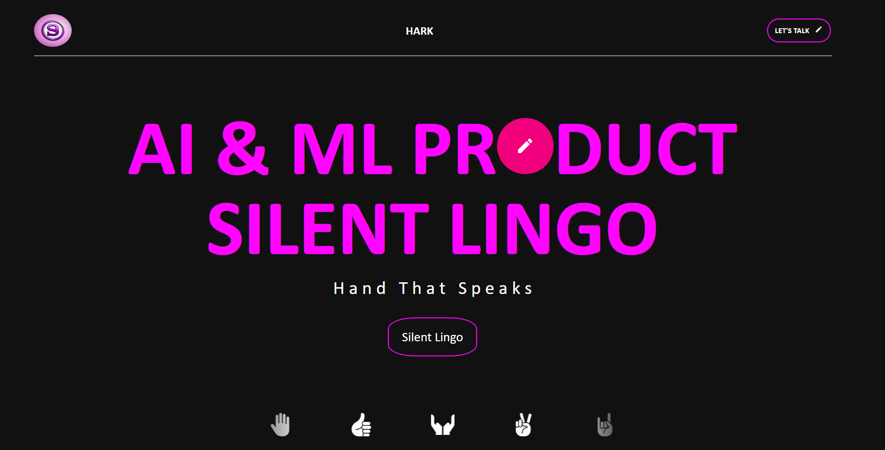
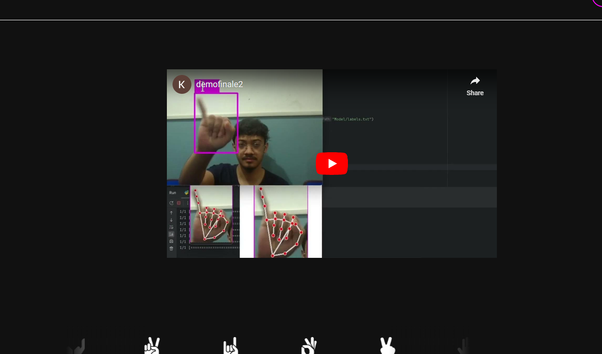

#Silent Lingo(HARK)

This is a Our second Hackathon Project a sign language detection app made using Python, keras, teachable machine
which can detect sign language and give output based on that. The app is deployed via the webiste

## Screenshots

## Visit the website :
[Silent Lingo](https://hark-silent-lingo.netlify.app/)
